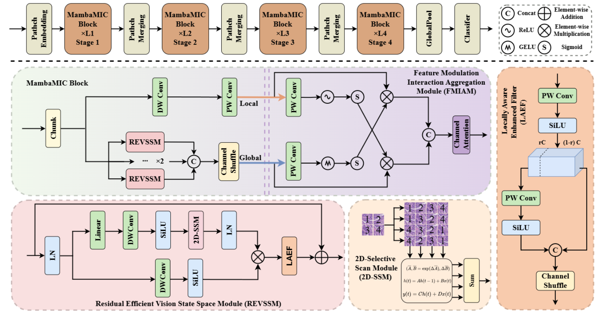
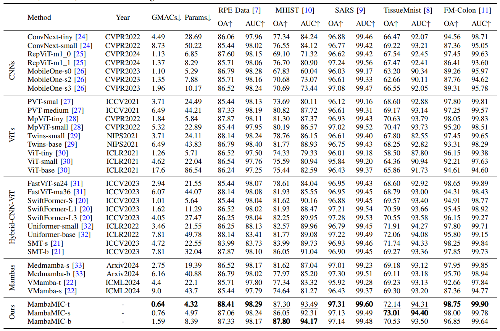
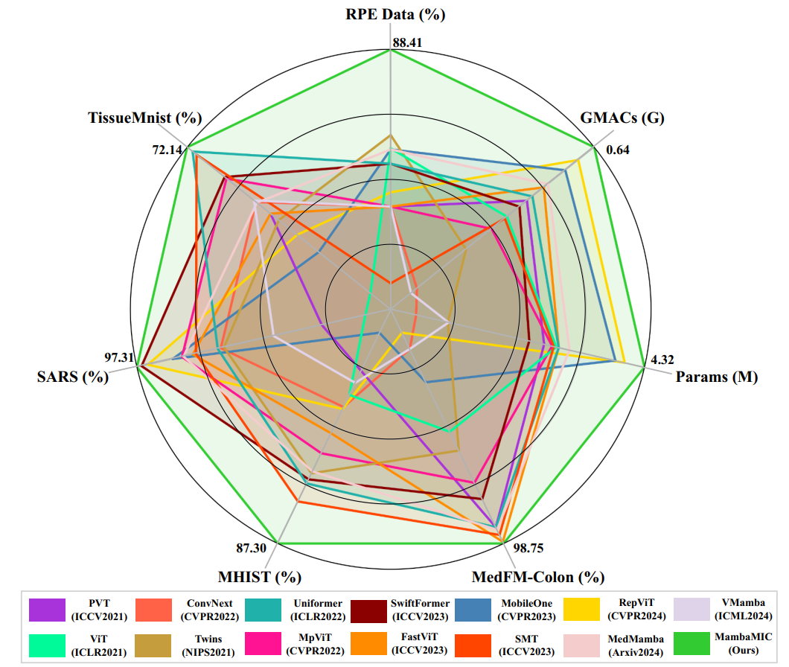

<div align="center">

<h3>MambaMIC: An Efficient Baseline for Microscopic
Image Classification with State Space Models</h3>

[[`Paper`](https://arxiv.org/abs/2409.07896)] 
[[`Project Page`]()]


</div>

## Abstract
In recent years, CNN and Transformer-based methods have made significant progress in Microscopic Image Classification (MIC). However, existing approaches still face the dilemma
between global modeling and efficient computation. While the
Selective State Space Model (SSM) can simulate long-range
dependencies with linear complexity, it still encounters challenges
in MIC, such as local pixel forgetting, channel redundancy, and
lack of local perception. To address these issues, we propose
a simple yet efficient vision backbone for MIC tasks, named
MambaMIC. Specifically, we introduce a Local-Global dualbranch aggregation module: the MambaMIC Block, designed
to effectively capture and fuse local connectivity and global
dependencies. In the local branch, we use local convolutions
to capture pixel similarity, mitigating local pixel forgetting and
enhancing perception. In the global branch, SSM extracts global
dependencies, while Locally Aware Enhanced Filter reduces
channel redundancy and local pixel forgetting. Additionally, we
design a Feature Modulation Interaction Aggregation Module for
deep feature interaction and key feature re-localization. Extensive
benchmarking shows that MambaMIC achieves state-of-the-art
performance across five datasets.

## Overview
<p align="center">
  
</p>

---

## 💎Let's Get Started!
### `A. Installation`

Note that the code in this repo runs under **Linux** system. We have not tested whether it works under other OS.

The repo is based on the [VMama repo](https://github.com/MzeroMiko/VMamba), thus you need to install it first. The following installation sequence is taken from the VMamba repo. 

**Step 1: Clone the repository:**

Clone this repository and navigate to the project directory:
```bash
git clone https://github.com/zs1314/MambaMIC.git
cd MambaMIC
```


**Step 2: Environment Setup:**

It is recommended to set up a conda environment and installing dependencies via pip. Use the following commands to set up your environment:

***Create and activate a new conda environment***

```bash
conda create -n MambaMIC
conda activate MambaMIC
```

***Install dependencies***

```bash
pip install -r requirements.txt
cd kernels/selective_scan && pip install .
```

### `B. Data Preparation`

The five datasets [RPE](https://www.ncbi.nlm.nih.gov/pmc/articles/PMC4760937/), [MHIST](https://bmirds.github.io/MHIST/) , [SARS](https://lhncbc.nlm.nih.gov/LHC-downloads/downloads.html#malaria-datasets) ,[TissueMnist](https://medmnist.com/) and [MedMf_colon](https://medfm2023.grand-challenge.org/medfm2023/) are used for MIC experiments. Please download them and make them have the following folder/file structure:
```
${DATASET_ROOT}   # Dataset root directory, for example: /home/username/data
├── RPE
    ├── train
    │   ├── class 1
    │   │   ├──00001.png
    │   │   ├──00002.png
    │   │   ├──00003.png
    │   │   ...
    │   │
    │   ├── class 2
    │   │   ├──00001.png
    │   │   ... 
    │   │
    │   └── class n
    │       ├──00001.png 
    │       ...   
    ├── val
    │   ├── ...
    ├── test
    │   ├── ...
    │   ...
├── MHIST
├── SARS
├── TissueMnist
├── MedMf_Colon
```
Or you can download it from here: [baidu](https://pan.baidu.com/s/1VzCz9UOKg0hyZIjvUOR8kA?pwd=1314 )


### `C. Model Training`


```bash
python train.py 
```

### `D. Model Testing`
```bash
python test.py 
```
🐥: Before training and testing, configure the relevant parameters in the script

## 🔎 Results
- results in Table 1 of the main paper

<p align="center">
  
</p>

- results in Figure 1 of the main paper

<p align="center">
  
</p>

## 🤝Acknowledgments
This project is based on VMamba ([paper](https://arxiv.org/abs/2401.10166), [code](https://github.com/MzeroMiko/VMamba)). Thanks for their excellent works!!

## 🙋Q & A
***For any questions, please feel free to [contact us.](zs@stu.njau.edu.cn)***
## 📜Reference

If this code or paper contributes to your research, please kindly consider citing our paper and give this repo ⭐️ 🌝
```


```


